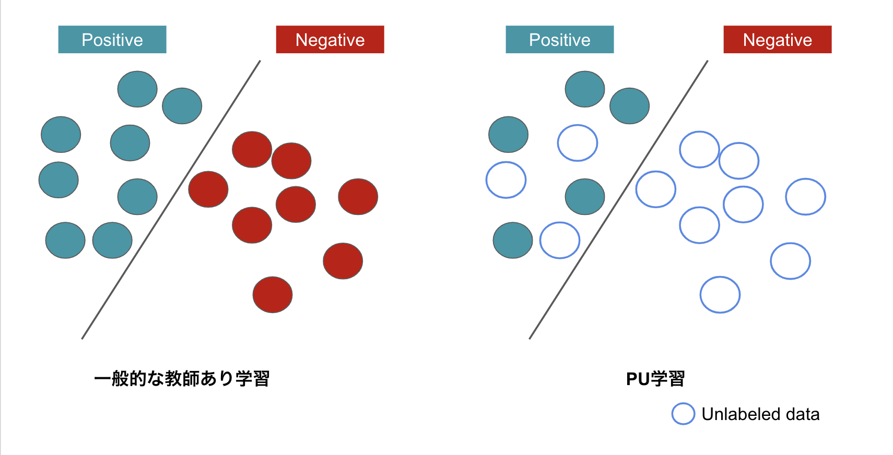
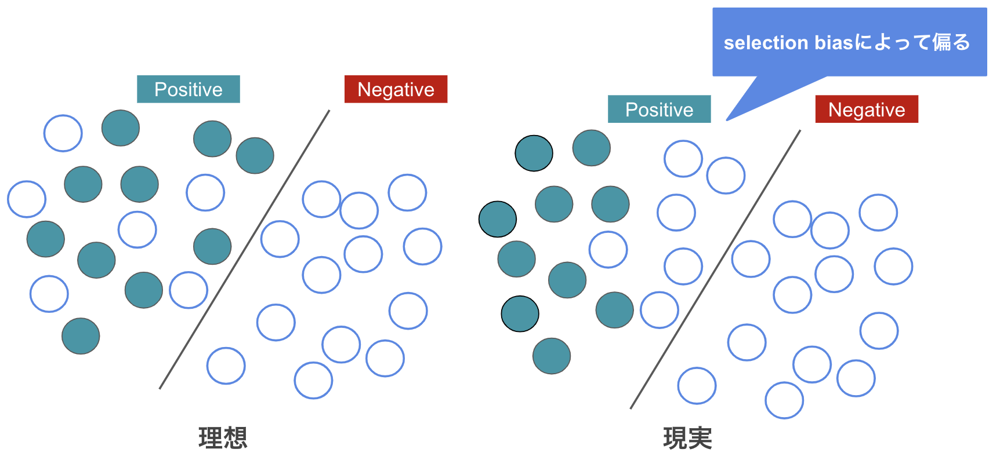
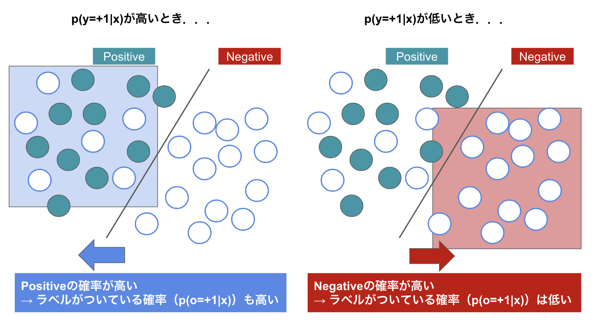
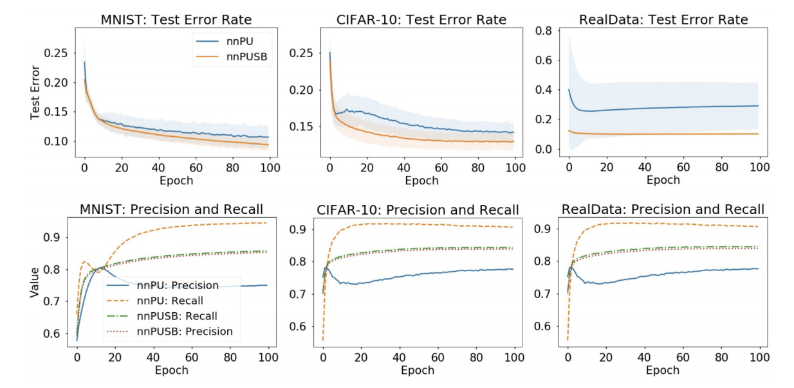

<!-- page_number: true -->

# ICLR2019における不完全ラベル学習
Ridge-i inc.
Masanari Kimura (mkimura@ridge-i.com)

---

# 概要
* ICLR2019に採択された不完全ラベル学習のまとめ

---

# 今回紹介する論文たち
* [1] Learning from Positive and Unlabeled Data with a Selection Bias
* [2] On the Minimal Supervision for Training Any Binary Classifier from Only Unlabeled Data
* [3] Multi-Class Classification without Multi-Class Labels

---
# 不完全ラベル学習
* 学習に用いられるデータのラベルが欠損しているという問題設定
* 今回は特に，Kクラス分類の際に，T(<=K)クラスのデータにラベルがついていないケースを考える．
	* e.g, 2値分類でPositiveクラスのデータにしかラベルが無い(PU) 

---
# Learning from Positive and Unlabeled Data with a Selection Bias
* Masahiro Kato, Takeshi Teshima, Junya Honda

---

## Abstract
* SCARを仮定せずにpositiveデータとunlabeledデータのみから学習
   * より現実の問題設定に即すようにselection biasを考慮

---

## PU Learning

* positveクラスとのデータとラベル無しデータのみから学習

---

## Selected Completely At Random (SCAR)

* (Assumption) Positiveなラベル付きデータはPositiveなラベル無しデータと同様の分布に属する
  * $\{x_i\}^n_{i=1}\sim^{i.i.d.} p(x|y=+1)$
* 現実問題ではラベリングの際のデータの選択に”バイアス”が掛かる
  * e.g. わかりやすいデータにはラベル付けがされやすい

---

## Selection Bias in the Labeling Process

* ラベリング時のバイアスによって，ラベルのついているpositiveデータとラベルのついていないpositiveデータの分布がずれる
  * 多くの現実の問題設定ではSCARは成り立たない

---

## PU Learning with Selection Bias
* positiveデータ集合$\{x_i\}^n_{i=1}$とunlabaledデータ集合$\{x'_i\}^{n'}_{i=1}$
  * $\{x_i\}^n_{i=1}\sim^{i.i.d} p(x|y=+1, o=+1),$
  * $\{x'_i\}^{n'}_{i=1}\sim^{i.i.d} p(x),$
* class prior $\pi = p(y=+1)$は既知
  * データ全体のpositiveデータの割合についての事前知識

---

## Identification Strategy
* Elkan & Noto (2008)[4]によって，PU learningに一切の仮定無しに$p(y=+1|x)$を推定することは出来ないことが示されている
  * 一般的にはSCARを仮定
  * $p(x|y=+1, o=+1) = p(x|y=+1, o=0)$
* 3番目の等号にSCARを仮定
  * $p(x|y=+1, o=+1)$は実際のサンプルから推定できる
  * $\pi$は過去の事前知識を活用できる

$p(y=+1|x) = \frac{p(x, y=+1)}{p(x)} = \frac{p(x|y=+1)\pi}{p(x)} = \frac{p(x|y=+1, o=+1)\pi}{p(x)}$

---

## Invariance of Order Assumption
$x_i, x_j\in{\chi}$について，

$p(y=+1|x_i)\leq p(y=+1|x_j)\Leftrightarrow p(o=+1|x_i)\leq p(o=+1|x_j)$

* ラベルはpositive data($y=+1$)のみに付与されることから仮定

---

## Strategy for Partial Identification and Classification

(Theorem) density ratio $r(x) = \frac{p(x|y=+1, o=+1)}{p(x)}$について，

$p(y=+1|x_i) \leq p(y=+1|x_j) \Leftrightarrow r(x_i) \leq r(x_j)$

が成り立つ．

* この$r(x)$を利用して，Binary Classifierがつくれる
  * ある閾値$\theta_\pi$を置いたとき，$r(x) > \theta_\pi$であればpositive
* 閾値$\theta_\pi$は，事前知識$\pi$を利用して計算
  * $\pi = \int \mathbb{1}[r(x) \geq \theta_\pi]p(x)dx$

---

## Algorithm Overview
1. Input: $p(x|y=+1)$, $p(x)$, class-prior $\pi$
2. $p(x|y=+1)$と$p(x)$を使ってdensity ratio $r(x)$を計算
3. $r(x)$を使って閾値$\theta_\pi$を計算
4. 得られる分類器は$h(x) = sign(r(x) - \theta_\pi)$

---

## Experimental Results
* MNIST, CIFAR-10, RealDataで実験

---
# On the Minimal Supervision for Training Any Binary Classifier from Only Unlabeled Data
* Nan Lu, Gang Niu, Aditya Krishna Menon, Masashi Sugiyama

---

## Abstract
* 出どころの違う２つのラベル無しデータ集合のみから分類器を学習

---
# Multi-class classification without multi-class labels
* Yen-Chang Hsu, Zhaoyang Lv, Joel Schlosser, Phillip Odom, Zsolt Kira

---

## Abstract
* 明示的なクラスラベルの付与なしに分類器を学習
  * クラスラベルの代わりにサンプル同士の類似度を活用

---
# References
* [1] Kato, Masahiro, Teshima, Takeshi, and Honda, Junya.Learning  from  positive  and  unlabeled  data  witha  selection  bias.    InInternational  Conference  onLearning  Representations,  2019.
* [2] Lu,   Nan,   Niu,   Gang,   Menon,   Aditya   K.,   andSugiyama,  Masashi.   On  the  minimal  supervisionfor  training  any  binary  classifier  from  only  unla-beled data. InInternational Conference on LearningRepresentations, 2019.
* [3] Hsu,   Yen-Chang,   Lv,   Zhaoyang,   Schlosser,   Joel,Odom,  Phillip,  and  Kira,  Zsolt.   Multi-class  clas-sification   without   multi-class   labels.InInter-national  Conference  on  Learning  Representations,2019. 
* [4] Charles Elkan and Keith Noto. Learning classifiers from only positive and unlabeled data. In ICDM, pp. 213–220, 2008.