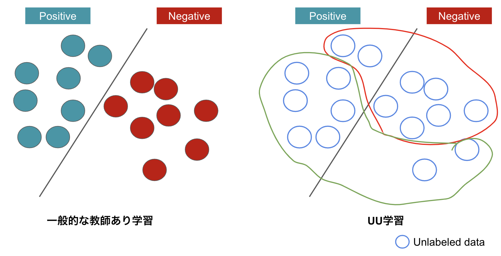
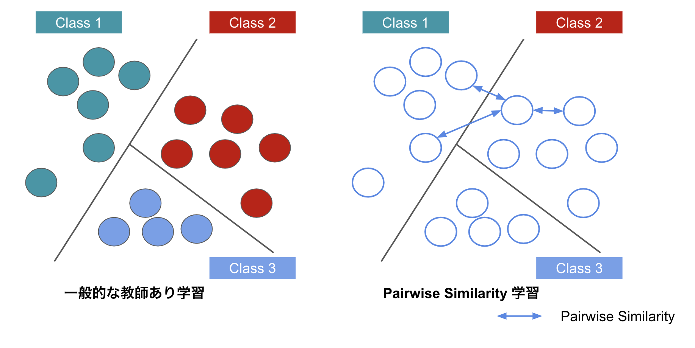
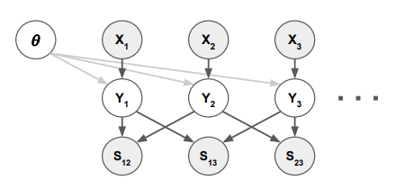

<!-- page_number: true -->

# ICLR2019における不完全ラベル学習
Ridge-i inc.
Masanari Kimura (mkimura@ridge-i.com)

---

# 概要
* ICLR2019に採択された不完全ラベル学習のまとめ
* ラベルが不完全な状況での学習という研究領域を知ってもらう

---

# 今回紹介する論文たち
* [1] Learning from Positive and Unlabeled Data with a Selection Bias
* [2] On the Minimal Supervision for Training Any Binary Classifier from Only Unlabeled Data
* [3] Multi-Class Classification without Multi-Class Labels

---
# 不完全ラベル学習
* 学習に用いられるデータのラベルが欠損しているという問題設定
  * Weakly-Supervised Learningなどとも
* 今回は特に，Kクラス分類の際に，T(<=K)クラスのデータにラベルがついていないケースを考える．
	* e.g, 2値分類でPositiveクラスのデータにしかラベルが無い(PU) 

---
# Learning from Positive and Unlabeled Data with a Selection Bias
* Masahiro Kato, Takeshi Teshima, Junya Honda

---

## Abstract
* SCARを仮定せずにpositiveデータとunlabeledデータのみから学習
   * より現実の問題設定に即すようにselection biasを考慮

---

## PU Learning

* positveクラスとのデータとラベル無しデータのみから学習

---

## Selected Completely At Random (SCAR)

* (Assumption) Positiveなラベル付きデータはPositiveなラベル無しデータと同様の分布に属する
  * $\{x_i\}^n_{i=1}\sim^{i.i.d.} p(x|y=+1)$
* 現実問題ではラベリングの際のデータの選択に”バイアス”が掛かる
  * e.g. わかりやすいデータにはラベル付けがされやすい

---

## Selection Bias in the Labeling Process

* ラベリング時のバイアスによって，ラベルのついているpositiveデータとラベルのついていないpositiveデータの分布がずれる
  * 多くの現実の問題設定ではSCARは成り立たない

---

## PU Learning with Selection Bias
* positiveデータ集合$\{x_i\}^n_{i=1}$とunlabaledデータ集合$\{x'_i\}^{n'}_{i=1}$
  * $\{x_i\}^n_{i=1}\sim^{i.i.d} p(x|y=+1, o=+1),$
  * $\{x'_i\}^{n'}_{i=1}\sim^{i.i.d} p(x),$
* class prior $\pi = p(y=+1)$は既知
  * データ全体のpositiveデータの割合についての事前知識

---

## Identification Strategy
* Elkan & Noto (2008)[4]によって，PU learningに一切の仮定無しに$p(y=+1|x)$を推定することは出来ないことが示されている
  * 一般的にはSCARを仮定
  * $p(x|y=+1, o=+1) = p(x|y=+1, o=0)$
* 3番目の等号にSCARを仮定
  * $p(x|y=+1, o=+1)$は実際のサンプルから推定できる
  * $\pi$は過去の事前知識を活用できる

$p(y=+1|x) = \frac{p(x, y=+1)}{p(x)} = \frac{p(x|y=+1)\pi}{p(x)} = \frac{p(x|y=+1, o=+1)\pi}{p(x)}$

---

## Invariance of Order Assumption
$x_i, x_j\in{\chi}$について，

$p(y=+1|x_i)\leq p(y=+1|x_j)\Leftrightarrow p(o=+1|x_i)\leq p(o=+1|x_j)$

* ラベルはpositive data($y=+1$)のみに付与されることから

---

## Strategy for Partial Identification and Classification

(Theorem) density ratio $r(x) = \frac{p(x|y=+1, o=+1)}{p(x)}$について，

$p(y=+1|x_i) \leq p(y=+1|x_j) \Leftrightarrow r(x_i) \leq r(x_j)$

が成り立つ．

* この$r(x)$を利用して，Binary Classifierがつくれる
  * ある閾値$\theta_\pi$を置いたとき，$r(x) > \theta_\pi$であればpositive
* 閾値$\theta_\pi$は，事前知識$\pi$を利用して計算
  * $\pi = \int \mathbb{1}[r(x) \geq \theta_\pi]p(x)dx$

---

## Algorithm Overview
1. Input: $p(x|y=+1)$, $p(x)$, class-prior $\pi$
2. $p(x|y=+1)$と$p(x)$を使ってdensity ratio $r(x)$を計算
3. $r(x)$を使って閾値$\theta_\pi$を計算
4. 得られる分類器は$h(x) = sign(r(x) - \theta_\pi)$

---

## Experimental Results
* MNIST, CIFAR-10, RealDataで実験

---
# On the Minimal Supervision for Training Any Binary Classifier from Only Unlabeled Data
* Nan Lu, Gang Niu, Aditya Krishna Menon, Masashi Sugiyama

---

## Abstract
* 出どころの違う２つのラベル無しデータ集合のみから分類器を学習

---

## UU Learning
* 収集方法の違う２つのラベルなしデータセットから学習
* クラスラベルの代わりに”データの出どころ”にラベリングするイメージ
  * クラスタリングではなく弱教師あり学習の区分

---
# Multi-class classification without multi-class labels
* Yen-Chang Hsu, Zhaoyang Lv, Joel Schlosser, Phillip Odom, Zsolt Kira

---

## Abstract
* 明示的なクラスラベルの付与なしに分類器を学習
  * クラスラベルの代わりにサンプル同士の類似度を活用

---

## Pairwise Similarity Learning

* クラスラベルではなくペアが似てるかどうかをラベリング
* 以下のような利点がある
  * クラス数が膨大な時に効率的にアノテーション可能
  * タスクによって再アノテーションが必要ない
  * クラス数可変のタスクに適用できる

---

## Notation of Meta Classification Learning

* 解きたいタスクは以下のグラフィカルモデルで表現できる

* 観測
  * サンプル集合$X = \{X_1,...,X_n\}$
  * 類似度集合$S=\{S_{ij}\}_{1\leq i,j\leq n}$
* 隠れ変数
  * クラスラベル集合$Y = \{Y_1,...,Y_n\}$
  * モデルのパラメータ$\theta$

---

## Meta Classification Learning

尤度は，

$L(\theta;X,Y,S) = P(X,Y,S;\theta) = P(S|Y)P(Y|X;\theta)P(X)$

* $Y$が一切得られていないので，$Y$について周辺化すると$\sum_Y P(S|Y)P(Y|X;\theta)$,
* この式の$P(S|Y) = \prod_{i,j} P(S_{i,j}|Y_i,Y_j)$部分の計算負荷が高いので集合の独立性を仮定して近似．

---

## A Loss Function

最終的に得たい目的関数は，

$L_{meta} = - \sum_{i,j} s_{ij}\log{\hat{s}_{ij}} + (1 - s_{ij})\log(1 - \hat{s}_{ij})$

* ここで$\hat{s}_{ij}$は$x_i$と$x_j$の間の類似度の予測値
* 類似度を近づけるように学習　→　ラベル不要

---

## Pairwise Similarity

* 類似度にはベクトルの内積を使える．例えば，

$\vec{v_1} = (0.0, 0.2, 0.8, 0.0)$
$\vec{v_2} = (0.2, 0.2, 0.3, 0.3)$
$\vec{v_3} = (0.1, 0.3, 0.6, 0.0)$

のとき，

$s_{12} = 0.28$
$s_{13} = 0.56$
$s_{23} = 0.26$

となり，$\vec{v_1}$と$\vec{v_3}$が似ているとみなせる．

---

## Pairwise Similarity for Multi-Label Classifier

* $\hat{s}_{ij}$は$x_i$と$x_j$の類似度．
  * $x_i$と$x_j$に対応するベクトルを決めたい．
  * 多クラス分類器$f(x_*)$を用意すると都合が良さそう
    
* （再活）最終的な目的関数

$L_{meta} = - \sum_{i,j} s_{ij}\log{\hat{s}_{ij}} + (1 - s_{ij})\log(1 - \hat{s}_{ij})$

$\hat{s}_{ij} = f(x_i ; \theta)^T f(x_j; \theta)$

明示的なラベル$Y$を一切使わずに，目的関数に多クラス分類器$f(\cdot; \theta)$を導入できた

---

# Conclusion
* ラベル不完全な問題設定のICLR2019採択論文を紹介
* 本来解けない問題設定でも仮定を導入することで可解になる
* 見えているタスクだけではなく見えない仮定を意識することが重要
  *  暗黙のうちに好ましくない仮定を置いていないか？
  *  ある仮定を置くことで可解なタスクに落ちないか？

---
# References
* [1] Kato, Masahiro, Teshima, Takeshi, and Honda, Junya.Learning  from  positive  and  unlabeled  data  witha  selection  bias.    InInternational  Conference  onLearning  Representations,  2019.
* [2] Lu,   Nan,   Niu,   Gang,   Menon,   Aditya   K.,   andSugiyama,  Masashi.   On  the  minimal  supervisionfor  training  any  binary  classifier  from  only  unla-beled data. InInternational Conference on LearningRepresentations, 2019.
* [3] Hsu,   Yen-Chang,   Lv,   Zhaoyang,   Schlosser,   Joel,Odom,  Phillip,  and  Kira,  Zsolt.   Multi-class  clas-sification   without   multi-class   labels.InInter-national  Conference  on  Learning  Representations,2019. 
* [4] Charles Elkan and Keith Noto. Learning classifiers from only positive and unlabeled data. In ICDM, pp. 213–220, 2008.