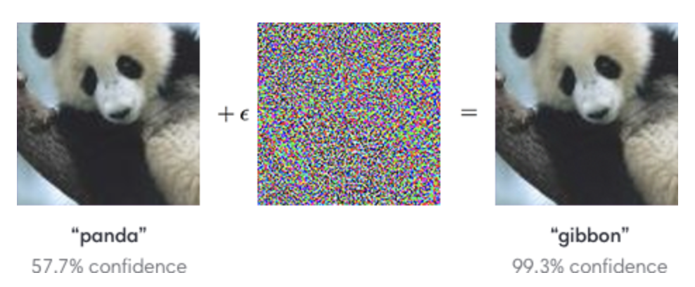
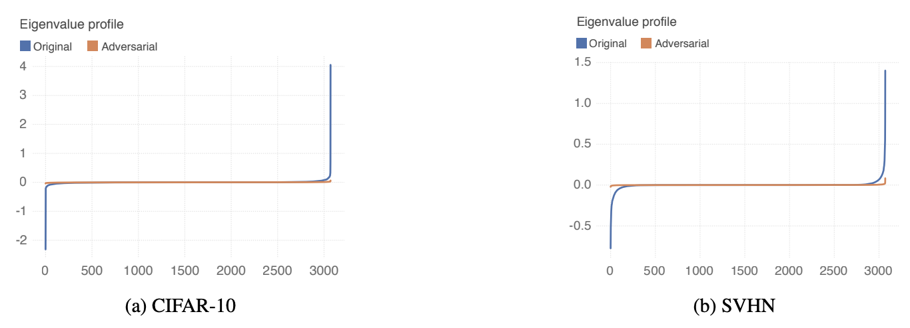
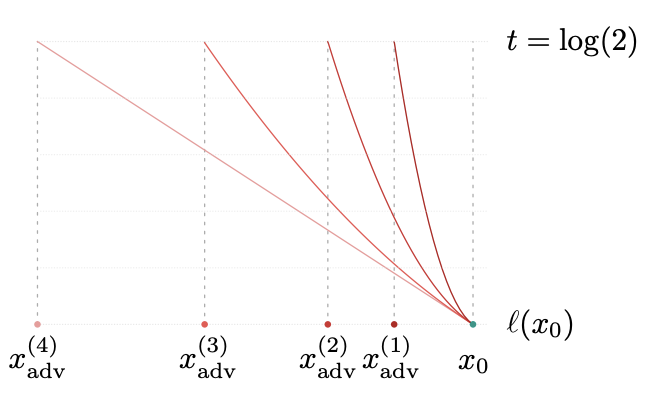
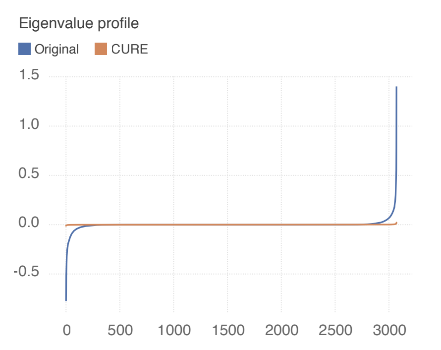
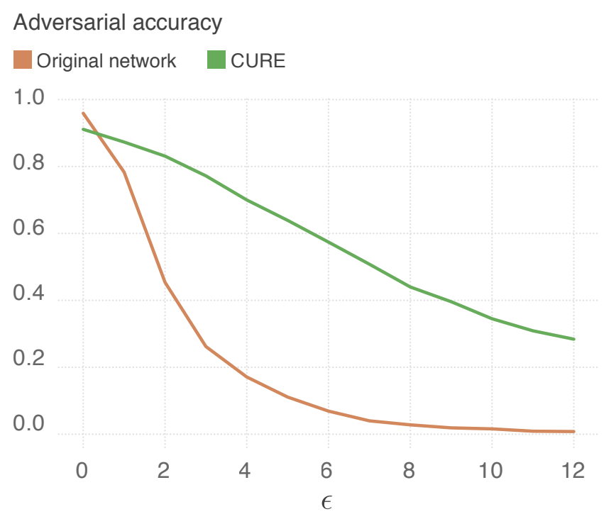

<!-- page_number: true -->

# Robustness via Curvature Regularization, and Vice Versa
Ridge-i inc.
Masanari Kimura (mkimura@ridge-i.com)

---

# About

  
### Education & Career
  
* 筑波大学卒 (2018)
* 株式会社Ridge-iエンジニア (2018 ~ )
* 産総研特専研究員 (2019 ~)

Twitterやってます

@machinery81
  

### Researches ater joining Ridge-i

* Interpretation of Feature Space using Multi-Channel Attentional Sub-Networks (<strong>CVPRW2019</strong>)
* Intentional Attention Mask Transformation for Robust CNN Classification (MIRU2019)
* PNUNet: Anomaly Detection using Positive-and-Negative Noise based on Self-Training Procedure (MIRU2019)
* Progressive Data Increasing as the Neural Network Initializer (JSAI2019)
* Anomaly Detection Using GANs for Visual Inspection in Noisy Training Data (<strong>ACCVW2018</strong>)
* Analyzing Centralities of Embedded Nodes (<strong>ICDMW2018</strong>)

---

今回紹介する論文

# Robustness via Curvature Regularization, and Vice Versa

---

# Abstract
* CVPR2019採択論文 [1]
* Adversarial Attacksに対するロバスト性が損失関数の曲率に依存することを示した
* 損失関数の曲率に基づくロバスト性のBoundsを示した
* DNNsのロバスト性を向上させる正則化手法を提案した

---

# Adversarial Attacks

* 人間には目視できない小さなノイズを画像に加えるだけでDNNsの誤分類を誘発できる．
* Adversarial Attacksを完全に阻止する防御手法は存在しない [2]

## 防御側のモチベーション

DNNsを騙すために必要なノイズのサイズを出来るだけ大きくする

---

# Why Study Adversarial Attacks ?

* スクリプトキディや悪意のある攻撃者からDNNsを守れる
* DNNsの解釈性が上がる
  * なぜDNNsが脆弱なのかを研究することで透明性が向上

---

# Adversarial Training

* Attackへの有効な防御手法の一つとしてAdversarial Trainingが存在する [3]．

## 直感的理解

* 攻撃に使われそうな微量なノイズをデータ拡張して分類器を学習

## Adversarial Trainingの解釈性
* 直感的には理解できるが，なぜうまくいくかはあまり議論されない
* 本論文ではAdversarial Trainingによるロバスト性の向上を損失関数の曲率の変形の観点から解釈

---

# Overview of the paper

本論文のお気持ち&大まかな流れ

1. Adversarial Trainingの有無で損失関数の曲率が変化することを観測
2. Attackに対するロバストネスのバウンドが曲率で与えられることを証明
3. 曲率を直接正則化することでAdversarial Trainingなしでロバストネスの向上を達成できることを主張

---

# Curvature of Loss Functions

Preliminaries.

* 画像$x\in{\mathbb{R}}^d$に対する任意の損失関数の曲率は，ヘッセ行列の固有値に対応する．

  
$H = \Big( \frac{\partial^2 \ell}{\partial x_i \partial x_j} \Big) \in{\mathbb{R}^{d\times d}}$
  

* Note: ヘシアン・ベクトル積は以下で与えられる．

  
  $Hz = \frac{\nabla \ell(x + hz) - \nabla \ell(x)}{h} \ \ for\ h\to 0.$
  

---

# Adversarial Training leads to decrease in the curvature

* Adversarial Trainingの前後での，曲率（$\simeq$ ヘッセ行列の固有値）の変化を観測

---

# Upper & Lower Bounds in Robustness

* ロバストネスのバウンドを導出できると，
  * DNNsがどれだけ脆弱なのかを見積れる
  * バウンドを抑えている項に曲率があれば，それに対して直接正則化をかけることでロバストネスを向上できる

---

* DNNsを誤分類させる最小のノイズは以下で与えられる．
  * $t$は誤分類するかどうかの閾値

  
  $r^* := argmin_r \|r\| \ \ s.t. \ \ell(x) + \nabla\ell(x)^Tr + \frac{1}{2}r^THr \geq t.$
  

* $c := t - \ell(x) \geq 0$，$g = \nabla\ell(x)$，$\nu$を$H$の最大の固有値，$u$を対応する固有ベクトルとすると，

  
  $\frac{\|g\|}{\nu} \Big( \sqrt{1 + \frac{2\nu c}{\|g\|^2}} - 1 \Big) \leq \|r^*\| \leq \frac{|g^Tu|}{\nu} \Big( \sqrt{1 + \frac{2\nu c}{(g^Tu)^2} - 1} \Big)$
  
  $\to \frac{c}{\|g\|} - 2\nu \frac{c^2}{\|g\|^3} \leq \|r^*\| \leq \frac{c}{\|g^Tu\|}$  

* Lower Boundはヘッセ行列の固有値で与えられる
* Upper Boundはヘッセ行列の固有ベクトルで与えられる

---

# Intuitive Understanding

* 得られたバウンドの直感的理解
* 曲率が低いほど，DNNsを騙すのに必要なノイズのサイズが大きい

---

# Curvature Reqularization (CURE) Method

* 観測：ロバストネスのバウンドが損失関数の曲率で与えられる
* 仮定：曲率を直接正則化すればロバストネスの向上を達成できる

$L_r = \mathbb{E} \|Hz\|^2$

$\to L_r = \|\nabla\ell(x + hz) - \nabla\ell(x)\|^2$

* ここで$z = \frac{sign(\nabla\ell(x))}{\|sign(\nabla\ell(x))\|}$

---

# Improving robustness through CURE

* CUREによって損失関数の曲率を抑えることができている
* 同時に，Attackに対するロバストネスの向上も確認

  

  

---

# Conclusion

* Adversarial Trainingによるロバストネス向上を，損失関数の曲率の変化の観点から解釈
* 損失関数の曲率に基づいたロバストネスのバウンドを導出

---

# References

* [1] Dezfooli, et al. "Robustness via Curvature Regularization, and Vice Versa" The IEEE Conference on Computer Vision and Pattern Recognition (CVPR). 2019.
* [2] Fawzi, Alhussein, Hamza Fawzi, and Omar Fawzi. "Adversarial vulnerability for any classifier." Advances in Neural Information Processing Systems. 2018.
* [3] Goodfellow, Ian J., Jonathon Shlens, and Christian Szegedy. "Explaining and harnessing adversarial examples." arXiv preprint arXiv:1412.6572 (2014).