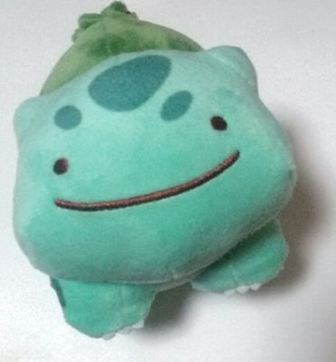

<!-- page_number: true -->

# Robustness via Curvature Regularization, and Vice Versa
Ridge-i inc.
Masanari Kimura (mkimura@ridge-i.com)

---

# About

  
### Education & Career
  
* 筑波大学卒 (2018)
* 株式会社Ridge-iエンジニア (2018 ~ )
* 産総研特専研究員 (2019 ~)

Twitterやってます

@machinery81
  

### Researches ater joining Ridge-i

* Interpretation of Feature Space using Multi-Channel Attentional Sub-Networks (CVPRW2019)
* Progressive Data Increasing as the Neural Network Initializer (JSAI2019)
* Anomaly Detection Using GANs for Visual Inspection in Noisy Training Data (ACCVW2018)
* Analyzing Centralities of Embedded Nodes (ICDMW2018)

---

今回紹介する論文

# Robustness via Curvature Regularization, and Vice Versa

---

# Abstract
* Adversarial Attacksに対するロバスト性が損失関数の曲率に依存することを示した
* 損失関数の曲率に基づくロバスト性のBoundsを示した
* DNNsのロバスト性を向上させる正則化手法を提案した

---

# Adversarial Attacks

---

# Why Study Adversarial Attacks ?

---

# Curvature of Loss Functions

---

# Adversarial Training leads to decrease in the curvature

---

# Curvature Reqularization (CURE) Method

---

# References

* [1] Dezfooli, et al. "Robustness via Curvature Regularization, and Vice Versa" The IEEE Conference on Computer Vision and Pattern Recognition (CVPR). 2019.