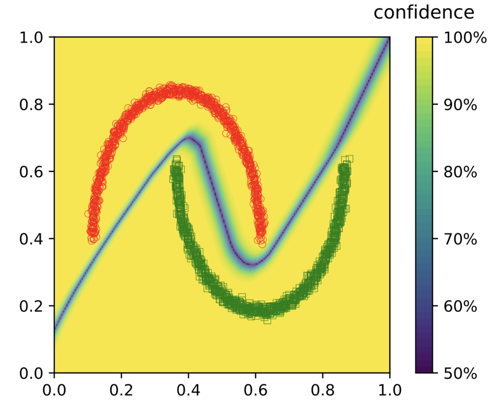

<!-- page_number: true -->

# Why ReLU Networks Yield High-Confidence Predictions Far Away From the Training Data and How to Mitigate the Problem
Ridge-i inc.
Masanari Kimura (mkimura@ridge-i.com)

---

# About

  
### Education & Career
  
* 筑波大学卒 (2018)
* 株式会社Ridge-iエンジニア (2018 ~ )
* 産総研特専研究員 (2019 ~)

Twitterやってます

@machinery81
  

### Researches ater joining Ridge-i

* Interpretation of Feature Space using Multi-Channel Attentional Sub-Networks (<strong>CVPRW2019</strong>)
* Intentional Attention Mask Transformation for Robust CNN Classification (MIRU2019)
* PNUNet: Anomaly Detection using Positive-and-Negative Noise based on Self-Training Procedure (MIRU2019)
* Progressive Data Increasing as the Neural Network Initializer (JSAI2019)
* Anomaly Detection Using GANs for Visual Inspection in Noisy Training Data (<strong>ACCVW2018</strong>)
* Analyzing Centralities of Embedded Nodes (<strong>ICDMW2018</strong>)

---

今回紹介する論文

# Why ReLU Networks Yield High-Confidence Predictions Far Away From the Training Data and How to Mitigate the Problem

---

# Abstract
* CVPR2019採択論文 [1]
* DNNsの出力の信頼度に関する論文

---

# Confidence of DNNs outputs

* 一般的なsoftmaxを用いたDNNsの出力例

---

# Problem of Overconfident Predictions
* 学習データと全く関係ないタスクのデータを入力
	*　DNNsは非常に高い確信度で適当なクラスに分類してしまう
	*　本当はどのクラスの予測確率も低くあってほしい 

---

# Problem of Overconfident Predictions

---

# Why ReLU Networks lead Overconfident ?

---

## ReLU networks produce piecewise affine functions

### → NN with ReLU = piecewise affine function $\circ$ classifier

---

## ReLU networks produce piecewise affine functions

ReLUを用いた，最終層が全結合層であるようなネットワークは，

  1. 入力を有限の超多面体に分割
  2. 全結合層で分類

と解釈できる[2]．

---

## Why ReLU Networks lead Overconfident ?

---

## Why ReLU Networks lead Overconfident ?

### ReLUを使ったネットワークは$\alpha x$の予測確率の極限が1になる

* $\alpha$は定数
* $\alpha x$とは？

---

## Intuitive Understanding

* 以下のように入力を変換

---

## Intuitive Understanding

* 学習データ＆想定した入力データは以下のエリアに変換

---

## Intuitive Understanding

* 想定していない入力データは以下のエリアに変換
* 定数$\alpha > 0$を掛ける→変換後の空間で右上に．．．
→　$\alpha x$ = 想定していない入力

---

（再活）

つまり，想定していない入力に対する予測確率の極限が1になる

---

## Adversarial Confidence Enhanced Training

* 想定していない入力に対する予測確率を低くするような正則化

---

## Adversarial Confidence Enhanced Training

* 想定していない入力に対する予測確率を低くするような正則化

---

# Experimental Results

* 各データセットに対するOverconfidentの実験結果

---

---

# Conclusion & 疑問

* ReLUを用いたネットワークのoverconfident問題について理由づけ
* それを解決する正則化手法を提案

* そもそもsoftmaxの出力を信頼度と捉えてしまっていいのか
  * 不確実性を取り扱う手法を検討した方がいい気もする 
    * Bayesian NNs etc.

---

# References

* [1] Hein, et al. "Why ReLU Networks Yield High-Confidence Predictions Far Away From the Training Data and How to Mitigate the Problem" The IEEE Conference on Computer Vision and Pattern Recognition (CVPR). 2019.
* [2] R. Arora, A. Basuy, P. Mianjyz, and A. "Mukherjee.Understanding deep neural networks with rectified linear unit" International Conference on Learning Representations (ICLR).2018.